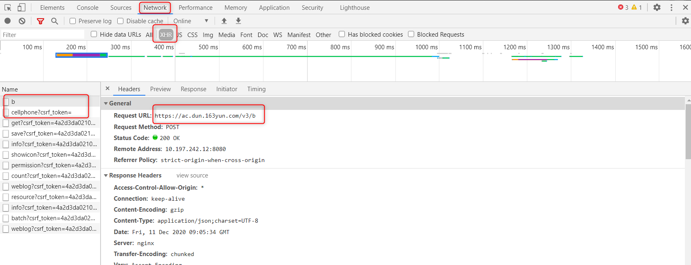
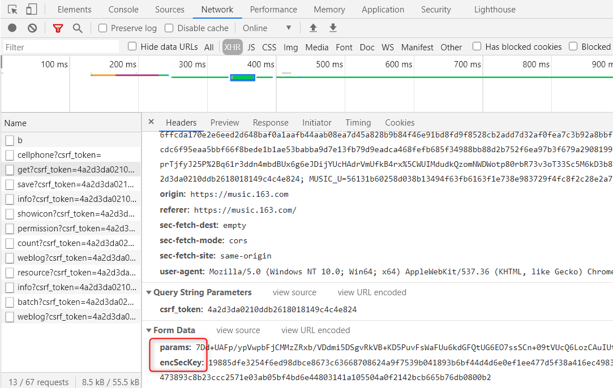
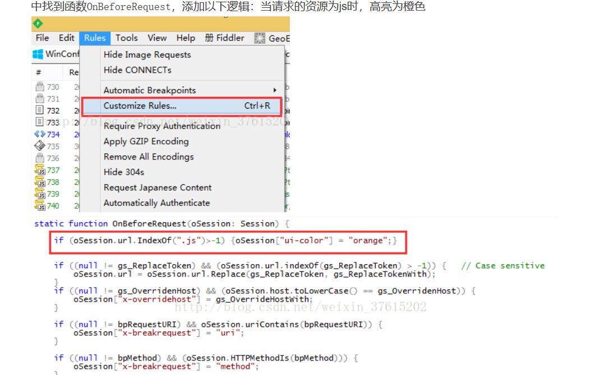
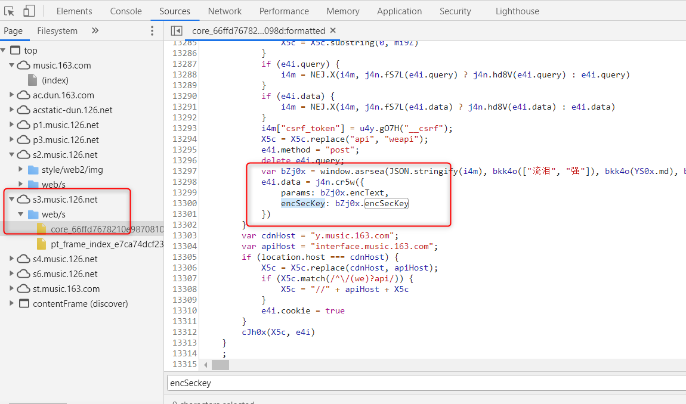
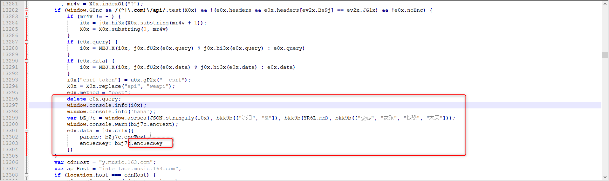
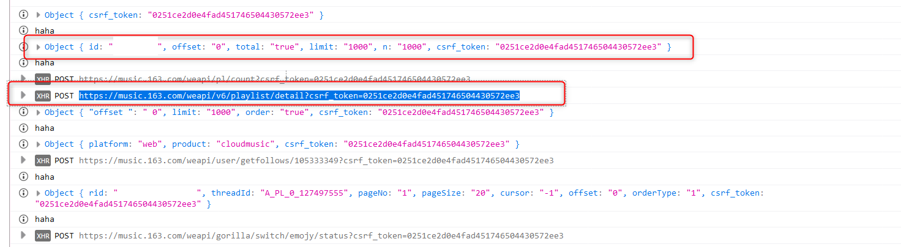
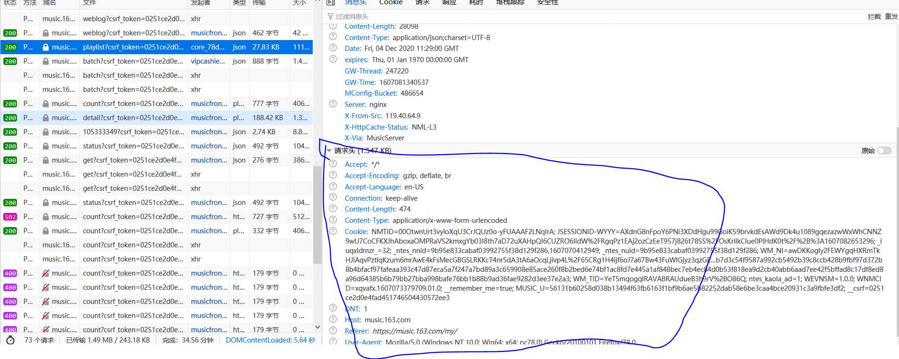

# NeteaseMusic_Spider
#### 工程说明
1. 爬取网易云音乐我喜欢的音乐这个歌单里面的歌名，演唱者还有专辑图片
2. 将歌名信息，演唱者信息生成词云图，专辑图片拼接成指定形状
3. 具体步骤及难点分析中的图片都在resource文件夹下面，如不显示，请下载到本地查看

#### 具体步骤及难点分析
+ 获取歌单内容
   + 首先先正常登录网易云官网，点击我的音乐，成功找到歌单。
   + F12开发者选项，可以看到对应的html语言
   + 先小试牛刀，使用request爬取这个页面的内容https://music.163.com/#/my/m/music/playlist?id=127497555
   + 响应码是200，还挺开心的，爬完notepad打开爬下来的内容，发现是网易云音乐登录页面的内容
   
+ 研究网站登录
   + F12一边登录一边看Network选项下的记录，刷新的网页比较多，可以加个过滤,只看XHR（可以简单理解为post请求）
   
   + 提交登录按钮的时候会产生一个b的XHR,可以看上图圈出来的地方
   + 研究这两个请求，尝试向这个网址提交账号密码数据 https://ac.dun.163yun.com/v3/b , 
   https://music.163.com/weapi/user/grabed/status/get?csrf_token=4a2d3da0210ddb2618018149c4c4e824
   + 按照用户名，密码的方式登录失败，加上'记住我'之后，还是不能获取正确的响应码和数据
   + 百度搜索，参考其他博主和大神，发现网易云提交的数据是经过加密的,而且每一次都会发生变化
   
   
+ 破解加密过程
   + 破解加密部分的代码主要参考下方的第四个链接
   + 理解这个过程并不难，重点是需要自己动手实践一遍。博主大神们想要爬取的网站跟我的并不相同，网上的参考资料也不全对
   + 自己动手实践的过程主要参考'糕糕python'的博文，见下面第一个链接网址

+ 梳理加密过程实践
   + 安装fiddler软件，tool文件夹里有安装包，fiddler所有权使用说明以fiddler官网为准
   + 安装好之后熟悉界面操作，我们主要使用左边的界面来关注所有的收发消息和右边工具栏下的AutoResponder(fiddler需要安装一下认证证书，浏览器和网页的通信会出问题)
   + 因为登录提交数据的时候，是经过js加密的，我们更改一下fiddler的默认配置，使得访问js的消息会黄色高亮
   
   + 在network里面Initiator里面可以查看对应的js文件，在浏览器中可以将js保存到本地查看。我们需要关注的是core.js(网站上core后面会带一串数字) \
   有点代码基础的小伙伴可以把这个js的调用关系捋一下,捋完了就可以看懂博主们写的代码
   
   + js文件里面是加密过程的破解，这个加密是有一个输入的，这个输入是需要通过打印的方式得到的，这个是我们提交数据的格式。在本地的js文件里加上这两句打印
   
   + 在fiddler中，设置，当访问数据请求core.js的时候，就使用本地的js来做响应。(相当于截胡)这样就可以顺利的看到请求的数据格式，见下图 \
   可以看到请求播放列表的时候提交的数据格式为'id': 'offset': "",'total': "",'limit': "",'n': "",'csrf_token': "" \
   登录界面的数据格式为'phone': '','password': '','rememberLogin': '','checkToken' : '','csrf_token' : '',其中password是hash之后的数据
   
   +  **爬取不同的界面，需要提交的数据格式不同，所以一定要学会使用fiddler截胡各个页面**

+ 完善request请求
   + 接下来是完善请求时候的请求头，还有cookie信息，目前网易云对于csrf_token没有启用校验如果开启的话，还需要把cookie里面的信息放到请求头里使用
   
   + 请求头设置好之后，如果你的数据格式，加密算法都没有问题的话，使用post方法应该就可以收到200响应，同时带有你想要的数据
   + 补充以下，get和post方法的区别，get就像是一个静态页面，东西已经加载好了在那里，你一调用get，就给你返回数据 \
     post方法更像是动态页面，东西没准备好，你post的时候告诉服务器你需要什么东西，然后服务器验证一下你提交的格式对不对，对的话，再匆匆忙忙把你要的宝贝返回给你

+ 处理返回的数据
   + 歌名，演唱者信息可以在返回的数据里直接拿到
   + 专辑图片的链接也在返回数据里，启用一个多进程将这些图片下载下来。进程数按照cpu的核数来设置。如果你不幸有一个12核的cpu的话，那你下载速度会非常快
   + 调用wordcloud模块生成词云图
   + 调用cv2/pil模块处理专辑图片 ->这部分内容详见另一个github，https://github.com/ZhouFall/image_handle

##### 最后处理好的结果放在output目录下

***
##### 参考网站：
1. https://www.jianshu.com/p/a45714d16294 网易云音乐爬虫（JS破解全过程）
2. https://www.cnblogs.com/bcaixl/p/13928629.html python3爬虫应用--爬取网易云音乐（两种办法）
3. https://blog.csdn.net/weixin_42555080/article/details/90105330 Python爬虫之网易云音乐数据爬取（十五）
4. https://www.zhihu.com/question/36081767 如何爬网易云音乐的评论数？
5. https://www.zhihu.com/question/36081767/answer/65820705 如何爬网易云音乐的评论数？
6. https://blog.csdn.net/qq_39138295/article/details/89226990 request保持会话，寻找set-cookie来获取数据